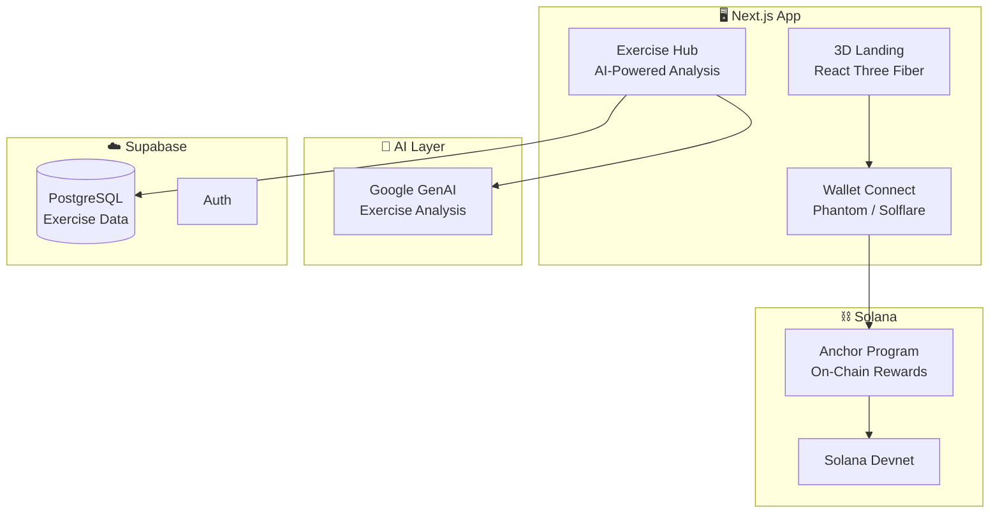

<p align="center">
  <h1 align="center">🧘 Sanctuary — Solana Wellness & Fitness Platform</h1>
  <p align="center"><strong>Web3-Powered Wellness with 3D Immersive Experiences</strong></p>
  <p align="center">
    A next-gen wellness and fitness platform built on Solana blockchain with immersive 3D experiences (React Three Fiber), AI-powered exercise analysis (Google GenAI), and on-chain reward systems. Features GSAP animations, Supabase backend, and Phantom wallet integration.
  </p>
</p>

<p align="center">
  <a href="https://sanctuary-flame-iota.vercel.app"></a>
</p>

<p align="center">
  
  
  
  
  
  
</p>

---

## ✨ Features

- 🌐 **3D Immersive UI** — React Three Fiber + Drei for stunning 3D visual experiences with post-processing effects
- 🧠 **AI Exercise Analysis** — Google GenAI-powered exercise recommendations and form analysis
- 💎 **Solana Integration** — Anchor program for on-chain rewards, wallet adapter for Phantom/Solflare
- 📊 **Exercise Tracking** — Supabase-backed exercise data with structured schemas
- 🎨 **Premium Animations** — GSAP scroll-triggered animations and transitions
- 🔐 **Web3 Auth** — Solana wallet-based authentication

---

## 🛠️ Tech Stack

| Layer | Technology |
|-------|-----------|
| **Framework** | Next.js (TypeScript) |
| **3D Engine** | React Three Fiber + Drei + Postprocessing |
| **Blockchain** | Solana (Anchor Programs) |
| **AI** | Google GenAI (@google/genai) |
| **Backend** | Supabase (PostgreSQL + Auth) |
| **Animations** | GSAP + @gsap/react |
| **UI** | Radix UI + Tailwind CSS |

---

## 🏗️ Architecture



---

## 📁 Project Structure

```
sanctuary/
├── src/                        # Next.js source
├── anchor-program/             # Solana smart contract (Anchor)
├── scripts/                    # Deployment & utility scripts
├── supabase-schema.sql         # Database schema
├── supabase-schema-exercises.sql # Exercise data schema
├── public/                     # Static assets
└── package.json
```

---

## 🚀 Quick Start

```bash
git clone https://github.com/deevashb24/sanctuary.git
cd sanctuary
npm install
npm run dev
```

Live at **[sanctuary-flame-iota.vercel.app](https://sanctuary-flame-iota.vercel.app)**

---

## 📄 License

MIT License

---

<p align="center">
  <strong>Find your sanctuary — on-chain wellness 🧘</strong>
</p>
